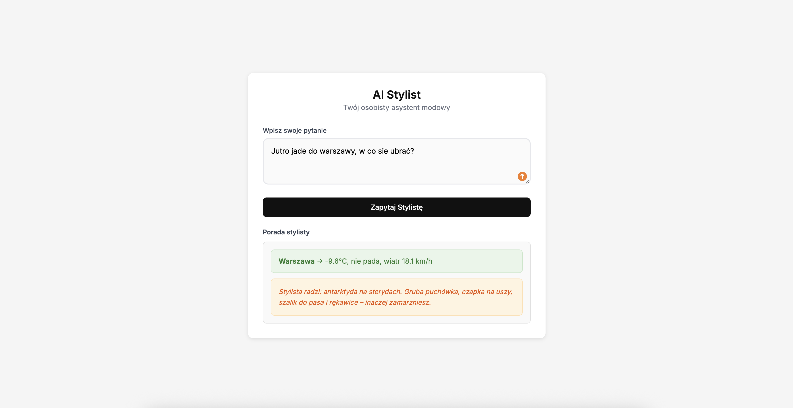
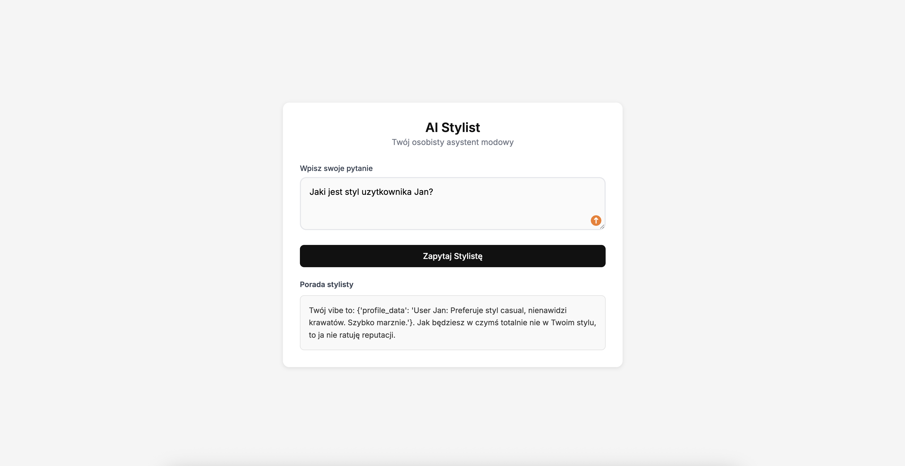

# AI Stylist Agent

Agent doradzajacy ubior z wykorzystaniem RAG i Function Calling (Gemini / Local Stub).

## Instalacja (Wymagany Python 3.12+)
1. Utworz srodowisko: `python3.12 -m venv venv`
2. Aktywuj: `source venv/bin/activate` (macOS/Linux) lub `venv\Scripts\activate` (Win)
3. Instalacja: `pip install -r requirements.txt`

## Konfig (.env)
1. `cp .env.template .env`
2. Ustaw `GOOGLE_API_KEY`.
3. Wybierz tryb w `LLM_PROVIDER`:
   - `gemini`: Pelny tryb AI (wymaga internetu oraz ustawionego api key).
   - `local_stub`: Tryb offline (symulacja do testow).

## Uruchomienie
Start serwera: `python -m uvicorn src.main_api:app --reload`
Dokumentacja (Swagger): http://127.0.0.1:8000/docs

## Frontend
(taki dodatek, nie trzeba odpalac ale fajnie wyglada)
1. Upewnij sie, ze serwer API dziala.
2. Otworz plik `index.html` w dowolnej przegladarce.
   - Mozesz tez uruchomic prosty serwer: `python3 -m http.server 3000`, a nastepnie wejsc na http://localhost:3000

  
  

## Architektura Systemu

### 1. Przepływ Sterowania (Function Calling Loop)
Użytkownik -> API (/ask) -> Guardrails (Security) -> LLMEngine -> LLM (Gemini/Stub)
   ^                                                                     |
   |-----------(Wynik Narzędzia) <--- Dispatcher <--- (Tool Call) -------|

### 2. Komponenty
- **Guardrails:** Warstwa sanitacji wejścia (blokada Prompt Injection) i walidacji wyjścia.
- **RAG Engine:** Wyszukiwanie wektorowe (FAISS) + Embeddingi. Dokleja kontekst do promptu systemowego przed wysłaniem do LLM.
- **Tool Registry:** Rejestr funkcji z dekoratorami. Obsługuje walidację typów i timeouty (max 5s na wykonanie).
- **LLM Engine:** Obsługuje logikę "pętli myślowej" (Chain of Thought) i decyduje, kiedy zakończyć rozmowę.

### 3. Bezpieczeństwo
- **Timeout:** Każde narzędzie jest ubijane po 5s, aby uniknąć zawieszenia serwera.
- **Prompt Injection:** Heurystyczna analiza słów kluczowych blokuje próby nadpisania instrukcji.
- **Error Handling:** Błędy narzędzi nie wywalają serwera, lecz wracają do modelu jako informacja zwrotna.
